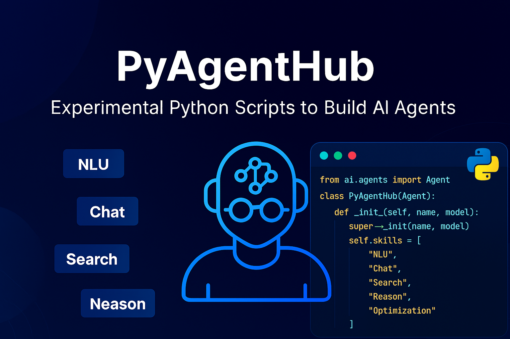
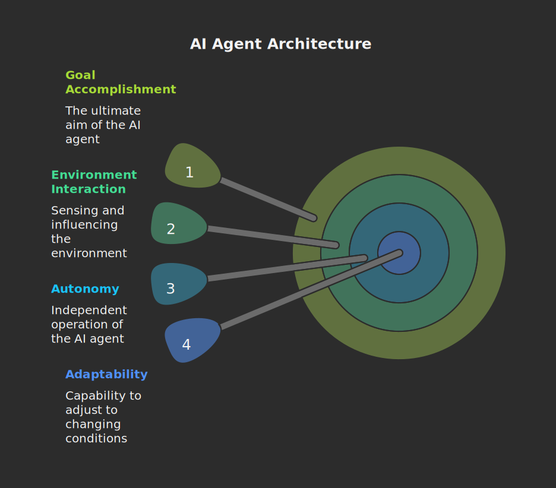

<h2 style="text-align:center;">🤖<br>Welcome to PyAgentHub</h2>
<h3 style="text-align:center;">Code smarter. Build agents.</h3>

<p style="text-align:center;">🧠 Built for developers, researchers, and curious minds<br>
🧩 Focused on modular, scalable agent design</p>

<p style="text-align:center;">This repository provides a comprehensive guide to building an AI agent using Python. It covers the fundamental concepts, essential libraries, and practical steps involved in creating an intelligent agent capable of interacting with its environment and achieving specific goals. We will explore different types of agents, their architectures, and implementation techniques, equipping you with the knowledge to develop your own AI agents for various applications.</p>

<h3 style="text-align:center;">Introduction to AI Agents</h3>
<p style="text-align:center;">An AI agent is an autonomous system that senses its environment through inputs and influences it through outputs. Its core purpose is to accomplish one or more defined goals. These agents can range from simple rule-based responders to advanced learning systems capable of adapting to dynamic conditions.</p>
<p style="text-align:center;">

</p>

<h3 style="text-align:center;">Key Components of an AI Agent</h3>
<p style="text-align:center;">
    <strong>Perception:</strong> The ability to sense and interpret the environment.<br>
    <strong>Reasoning:</strong> The ability to process information and make decisions.<br>
    <strong>Action:</strong> The ability to execute actions that affect the environment.<br>
    <strong>Learning:</strong> The ability to improve performance over time through experience.
<p>

<h3 style="text-align:center;">Types of AI Agents</h3>
<p style="text-align:center;">
    <strong>Simple Reflex Agents:</strong> These agents react directly to percepts based on predefined rules. They have no memory of past states.<br>
    <strong>Model-Based Reflex Agents:</strong> These agents maintain an internal model of the environment to make decisions based on past experiences and current percepts.<br>
    <strong>Goal-Based Agents:</strong> These agents have a specific goal in mind and make decisions to achieve that goal.<br>
    <strong>Utility-Based Agents:</strong> These agents consider multiple goals and choose actions that maximize their overall utility or happiness.<br>
    <strong>Learning Agents:</strong> These agents can learn from experience and improve their performance over time.
</p>

<h3 style="text-align:center;">Setting Up the Environment</h3>
<p style="text-align:center;">This involves installing Python and the necessary libraries.</p>

<h4 style="text-align:center;">1. Installing Python</h4>
<p style="text-align:center;">Don’t have Python yet? Download and install the latest Python release from <a href="https://www.python.org" target="_blank">https://www.python.org ↗</a>, following the OS-specific installation steps.</p>
<p style="text-align:center; border: 1px solid #06d; padding: 10px;"><strong>Tip:</strong> On Windows, during installation, check <code>Add Python to PATH</code> to make it accessible from the command line.
</p>

<h4 style="text-align:center;">2. Verify Installation</h4>
<p style="text-align:center;">Open a terminal or command prompt and run:</p>
<pre style="border: 1px solid #06d; padding: 10px;"><strong>Bash or Command Prompt</strong><hr>python --version</pre>

<p style="text-align:center;">You should see the installed Python version (e.g., Python 3.xx.x).
</p>

<h4 style="text-align:center;">3. Create a Project Directory</h4>
<p style="text-align:center;">Organize your work by creating a dedicated folder:</p>
<pre style="border: 1px solid #06d; padding: 10px;"><strong>Bash or Command Prompt</strong><hr>mkdir ai-agent
cd ai-agent
</pre>

<h4 style="text-align:center;">4. Set Up a Virtual Environment</h4>
<p style="text-align:center;">A virtual environment keeps your project dependencies isolated.</p>
<pre style="border: 1px solid #06d; padding: 10px;"><strong>Bash or Command Prompt</strong><hr>python -m venv <your_env_name>
</pre>

<h4 style="text-align:center;">5. Activate the Virtual Environment</h4>
<p style="text-align:center;">A virtual environment keeps your project dependencies isolated.</p>
<table style="width: 100%;">
    <tr>
        <td><pre style="border: 1px solid #06d; padding: 10px;"><strong>Bash: Windows</strong><hr>source [env_name]/Scripts/activate
</pre></td>
        <td><pre style="border: 1px solid #06d; padding: 10px;"><strong>Windows Command Prompt</strong><hr>[env_name]/Scripts/activate
</pre></td>
        <td><pre style="border: 1px solid #06d; padding: 10px;"><strong>Bash: macOS / Linux</strong><hr>source [env_name]/bin/activate
</pre></td>
    </tr>
</table>

<h4 style="text-align:center;">6. Upgrade pip</h4>
<p style="text-align:center;">Ensure you have the latest package manager:</p>
<pre style="border: 1px solid #06d; padding: 10px;"><strong>Bash or Command Prompt</strong><hr>pip install --upgrade pip
</pre>

<h4 style="text-align:center;">7. Install Required Packages</h4>
<p style="text-align:center;">For a basic AI agent setup:</p>
<pre style="border: 1px solid #06d; padding: 10px;"><strong>Bash or Command Prompt</strong><hr>pip install openai langchain python-dotenv
</pre>

<h4 style="text-align:center;">8. Configure Environment Variables</h4>
<p style="text-align:center;">Create a <code>.env</code> file in your project root to store API keys securely
:</p>
<pre style="border: 1px solid #06d; padding: 10px;"><strong>Bash or Command Prompt</strong><hr>

```bash
OPENAI_API_KEY=your_openai_key_here
```
</pre>

<p style="text-align:center;">Load it in your Python code:</p>

```python
from dotenv import load_dotenv
load_dotenv()
```

<h4 style="text-align:center;">9. Test the Setup</h4>
<p style="text-align:center;">Run a quick Python check:</p>

```python
print("Environment is ready!")
```
<p style="text-align:center;">If no errors appear, your environment is successfully configured.</p>

<h4 style="text-align:center;">10. 🚀 Run a Starter AI Agent</h4>
<p style="text-align:center;">Once your environment is ready, you can test it by creating <code>agent.py</code> with a minimal AI agent that uses LangChain and the OpenAI API.</p>

<pre style="border: 1px solid #06d; padding: 10px;"><strong>📂 Project Structure</strong><hr>ai-agent/
│
├── env_name/             # Virtual environment folder
├── .env                  # API keys and secrets
├── agent.py              # Starter AI agent script
└── requirements.txt      # Optional: freeze dependencies
</pre>

```python
import os
from dotenv import load_dotenv
from langchain.chat_models import ChatOpenAI
from langchain.agents import initialize_agent, AgentType
from langchain.tools import Tool
from langchain.utilities import DuckDuckGoSearchAPIWrapper

# 1. Load environment variables from .env
load_dotenv()

# 2. Get your API key
openai_api_key = os.getenv("OPENAI_API_KEY")
if not openai_api_key:
    raise ValueError("OPENAI_API_KEY not found in .env file")

# 3. Initialize the LLM
llm = ChatOpenAI(
    temperature=0,
    model="gpt-3.5-turbo",  # Change to gpt-4 if available
    openai_api_key=openai_api_key
)

# 4. Add a simple search tool
search = DuckDuckGoSearchAPIWrapper()
tools = [
    Tool(
        name="Web Search",
        func=search.run,
        description="Search the web for current information"
    )
]

# 5. Create the agent
agent = initialize_agent(
    tools,
    llm,
    agent=AgentType.ZERO_SHOT_REACT_DESCRIPTION,
    verbose=True
)

# 6. Run the agent
if __name__ == "__main__":
    query = "What's the latest news about AI agents?"
    print(f"🤖 Asking agent: {query}")
    response = agent.run(query)
    print("\nAgent Response:\n", response)
```
<h3 style="text-align:center;">Test the Agent</h3>
<p style="text-align:center;">Activate your virtual environment:</p>

```python
python agent.py
```

<hr>
<h6 style="text-align:center;">🔍 Fresh code drops ahead. Keep an eye on PyAgentHub! 🚀<br><br>Thank You!</h6>